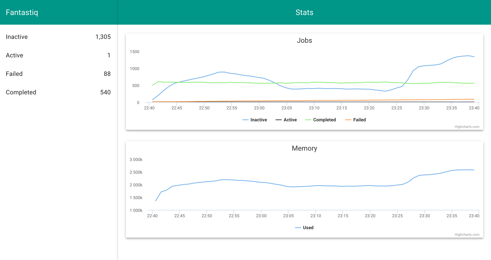

# fantastiq

[travis-url]: http://travis-ci.org/Janpot/fantastiq
[travis-image]: http://img.shields.io/travis/Janpot/fantastiq.svg?style=flat

[depstat-url]: https://david-dm.org/Janpot/fantastiq
[depstat-image]: http://img.shields.io/david/Janpot/fantastiq.svg?style=flat

Reliable job queue in Redis, guaranteed atomic handling of all operations, promises based, provides a REST API and a user interface.
Inspired heavily by [kue](https://www.npmjs.com/package/kue) but with different semantics.
This library contains a full set of primitives to construct your own worker (`retrieve` + `acknowledge`) as well as a `process` function to automatically handle the queue.

[![Build Status][travis-image]][travis-url] [![Dependency Status][depstat-image]][depstat-url]

<!-- START doctoc generated TOC please keep comment here to allow auto update -->
<!-- DON'T EDIT THIS SECTION, INSTEAD RE-RUN doctoc TO UPDATE -->
##Table of Contents

- [Features](#features)
- [Usage](#usage)
- [API](#api)
    - [`fantastiq(RedisClient client, [Object options])` -> `Queue`](#fantastiqredisclient-client-object-options---queue)
        - [Option: `String prefix`](#option-string-prefix)
    - [`Queue`](#queue)
      - [`.config([Object configuration])` -> `Promise<Object configuration>`](#configobject-configuration---promiseobject-configuration)
        - [Option: `Number timeout`](#option-number-timeout)
        - [Option: `Number removeCompletedAfter`](#option-number-removecompletedafter)
        - [Option: `Number removeFailedAfter`](#option-number-removefailedafter)
        - [Option: `Number throttle`](#option-number-throttle)
      - [`.add(dynamic job, [Object options])` -> `Promise<String id>`](#adddynamic-job-object-options---promisestring-id)
        - [Option: `Number priority`](#option-number-priority)
      - [`.addN(Array<dynamic> jobs, [Object options])` -> `Promise<Array<String> ids>`](#addnarraydynamic-jobs-object-options---promisearraystring-ids)
      - [`.get(String id)` -> `Promise<dynamic job>`](#getstring-id---promisedynamic-job)
      - [`.getN(Array<String> ids)` -> `Promise<Array<dynamic> jobs>`](#getnarraystring-ids---promisearraydynamic-jobs)
      - [`.remove(String id)` -> `Promise<Number removedCount>`](#removestring-id---promisenumber-removedcount)
      - [`.removeN(Array<String> ids)` -> `Promise<Number removedCount>`](#removenarraystring-ids---promisenumber-removedcount)
      - [`.retrieve([Object options])` -> `Promise<Object retrieveResult>`](#retrieveobject-options---promiseobject-retrieveresult)
        - [Option: `Boolean unthrottle`](#option-boolean-unthrottle)
      - [`.acknowledge(String id, [Error error], [dynamic result])` -> `Promise<String id>`](#acknowledgestring-id-error-error-dynamic-result---promisestring-id)
      - [`.range(String state, [Object options])` -> `Promise<Array<String id>>`](#rangestring-state-object-options---promisearraystring-id)
        - [option: `Number count`](#option-number-count)
        - [option: `String start`](#option-string-start)
        - [option: `String order`](#option-string-order)
      - [`.stat()` -> `Promise<Object stats>`](#stat---promiseobject-stats)
      - [`.metrics()` -> `Promise<Object metrics>`](#metrics---promiseobject-metrics)
      - [`.process(Function doWorkFn, [Object options])` -> `Worker`](#processfunction-doworkfn-object-options---worker)
        - [Option: `Number pollTime`](#option-number-polltime)
      - [`.api()` -> `express.Router apiRouter`](#api---expressrouter-apirouter)
      - [`.ui()` -> `express.Router uiRouter`](#ui---expressrouter-uirouter)
    - [`Worker`](#worker)
      - [`.start()` -> `Worker`](#start---worker)
      - [`.stop()` -> `Promise<null>`](#stop---promisenull)
      - [`.unthrottle()` -> `null`](#unthrottle---null)
- [Roadmap](#roadmap)

<!-- END doctoc generated TOC please keep comment here to allow auto update -->

## Features

- Atomic operations
- promises based ([bluebird](https://www.npmjs.com/package/bluebird))
- Job priority
- worker
- REST API
- UI

## Usage

```js
var redis = require('then-redis');
var fantastiq = require('fantastiq');

var client = redis.createClient();
var queue = fantastiq(client);

// Use pocess function to automatically handle jobs
queue.process(function (job) {
  // ...
  // return a promise here
});

queue.add({
  // ...
});
```

Or

```js
(function tick() {
  queue.retrieve()
    .then(function (result) {
      return queue.get(result.id);
    })
    .then(function (job) {
      // ... do something with job.data
      return queue.acknowledge(job.id);
    })
    .catch(function (err) { console.error(err.message); })
    .delay(1000)
    .then(tick)
}())
```

## API

#### `fantastiq(RedisClient client, [Object options])` -> `Queue`

Construct a queue. The passed in [then-redis](https://www.npmjs.com/package/then-redis) client will be used to connect to Redis.
The returned object can be used to manage the queue.

Example:

```js
var redis = require('then-redis');
var fantastiq = require('fantastiq');

var client = redis.createClient();
var queue = fantastiq(client, {
  prefix: 'my-queue'
});
```

###### Option: `String prefix`

You can specify a prefix for theis queue. Use this in case you want to run multiple queues on the same Redis.
By default fantastiq will namespace its keys under `{fantastiq}:`.

<hr>

#### `Queue`

##### `.config([Object configuration])` -> `Promise<Object configuration>`

Used to configure the queue. Configuration is centralized in Redis so multiple workers always act on the same configuration.

Example:

```js
queue.config({
  timeout: 10000,
  removeCompletedAfter: 3600000,
  removeFailedAfter: null,
  throttle: null
})
  .then(function (config) {
    // this will print '10000'
    console.log(config.timeout);
  });
```

###### Option: `Number timeout`

Time in milliseconds before an active job times out. It will be marked as 'failed' with an error specifying the timeout.
By default jobs time out after 30 seconds.

###### Option: `Number removeCompletedAfter`

Time in milliseconds before a job that has the state 'completed' will be deleted.
By default fantastiq will not delete any job.

###### Option: `Number removeFailedAfter`

Time in milliseconds before a job that has the state 'failed' will be deleted.
By default fantastiq will not delete any job.

###### Option: `Number throttle`

Minimum time in milliseconds between two retrieves.
The queue will not activate a job until this time has elapsed since the last retrieve.
By default will not use throttling

<hr>

##### `.add(dynamic job, [Object options])` -> `Promise<String id>`

Adds a job to the queue. The type can be anything like objects, strings and numbers.
The job will have an id assigned by the queue which is returned in the resulting promise.

Example:

```js
var job = {
  imageToCrop: __dirname + '/to-process/image.png'
};

queue.add(job, { priority: 10 })
  .then(function (id) {
    // this will print the assigned id
    console.log(id);
  });
```

###### Option: `Number priority`

The prority for this job. Lowest values for priority will be processed first.
By default fantastiq assigns a priority of `0`.

<hr>

##### `.addN(Array<dynamic> jobs, [Object options])` -> `Promise<Array<String> ids>`

Same as [`.add`](#adddynamic-job-object-options---promisestring-id) but with multiple jobs. Will return a promise of an array of ids instead.

Example:

```js
queue.addN([
  { imageToCrop: __dirname + '/to-process/image-1.png' },
  { imageToCrop: __dirname + '/to-process/image-2.png' },
  { imageToCrop: __dirname + '/to-process/image-3.png' }
], { priority: -1 })
  .then(function (ids) {
    // this will print the assigned ids
    console.log(ids);
  });
```

<hr>

##### `.get(String id)` -> `Promise<dynamic job>`

Fetches all the properties associated with a job. Will return `null` if the job doesn't exist.

Example:

```js
queue.get('0000000000001')
  .then(function (job) {
    // this will print an object with all the properties associated with the job
    console.log(job);
  });
```

The resulting object contains following properties:

- `String id`: the id for this job
- `String state`: the state this job is currently in
- `Number created`: Unix timestamp of when the job was created
- `Number started`: Unix timestamp of when the job was activated
- `Number finished`: Unix timestamp of when the job was completed
- `Number priority`: The priority assigned to this job
- `dynamic data`: The actual job content
- `dynamic result`: The result that was returned when this job was completed
- `Error error`: The error that was returned when this job was completed

<hr>

##### `.getN(Array<String> ids)` -> `Promise<Array<dynamic> jobs>`

Same as [`.get`](#getstring-id---promisedynamic-job) but for multiple jobs. Will return an array of job objects instead.

Example:

```js
queue.getN(['0000000000001', '0000000000002', '0000000000003'])
  .then(function (jobs) {
    // this will print an array of job objects
    console.log(jobs);
  });
```

<hr>

##### `.remove(String id)` -> `Promise<Number removedCount>`

Deletes a job from the queue. This will remove the job and all of its associated data.
returns the amount of jobs that were removed.

Example:

```js
queue.remove('0000000000001')
  .then(function (count) {
    // this will print 1 if the job existed, 0 otherwise
    console.log(count);
  });
```

<hr>

##### `.removeN(Array<String> ids)` -> `Promise<Number removedCount>`

Same as [`.remove`](#removestring-id---promisenumber-removedcount) but for multiple jobs.

Example:

```js
queue.removeN(['0000000000001', '0000000000002', '0000000000003'])
  .then(function (count) {
    // this will print the amount of jobs that existed at the time of the call
    console.log(count);
  });
```

<hr>

##### `.retrieve([Object options])` -> `Promise<Object retrieveResult>`

Activates a job. This will set the state of the next job to 'active' and return its id.

The resulting object contains following properties:

- `String id`: The id of the job that was activated. `null` if there are no jobs available.
- `dynamic data`: The data associated with this job or `null` if there's no job returned.
- `Number wait`: in case a [throttle](#option-number-throttle) is configured it will suggest a time to wait before attempting a new retrieve, else it will be `0`.

Example:

```js
queue.retrieve()
  .then(function (result) {
    // this prints the id of the activated job, use .get to fetch the data
    console.log(result.id);
  })
```

###### Option: `Boolean unthrottle`

Set this to `true` if you want to reset the throttle and activate a job regardless.

Example:

```js
queue.retrieve({ unthrottle: true })
  .then(function (result) {
    // This will return a job id even when the queue is throttled
    console.log(result.id);
  })
```

<hr>

##### `.acknowledge(String id, [Error error], [dynamic result])` -> `Promise<String id>`

Signals the queue a job is completed. This will tarnsition the job from the 'active' stated to either 'failed' or 'completed'.
When it gets called with an `Error` object, the job is assumed to have 'failed', else it is 'completed'.
An optional third parameter contains a result for the job and wil be stored in the queue as well.

Example:

```js
queue.acknowledge('0000000000001', null, { path: __dirname + '/finished/image.png' });
```

<hr>

##### `.range(String state, [Object options])` -> `Promise<Array<String id>>`

Queries the queue for a range of jobs for a certain state. state can either be `'inactive'`, `'active'`, `'completed'` or `'failed'`.
The options object can be used to further specify the query. It returns with a promise for an array of ids.

Example:

```js
queue.range('completed', {
  count: 20,
  start: '00000000000A7',
  order: 'asc'
})
  .bind(queue)
  .map(queue.getN)
  .then(function (jobs) {
    console.log(jobs);
  })
```

###### option: `Number count`

The amount of jobs that is expected to be returned. By default `.range` will return 10 jobs.

###### option: `String start`

The id of the jobs to start the result with. By default the first element is assumed.

###### option: `String order`

The order in which to return results. Can either be `asc` or `desc`

<hr>

##### `.stat()` -> `Promise<Object stats>`

Returns a promise with statistics on the current job count. The resulting object contains following properties:

- `Number totalCount`: The total amount of items in the queue.
- `Number inactiveCount`: The total amount of inactive items in the queue.
- `Number activeCount`: The total amount of active items in the queue.
- `Number failedCount`: The total amount of failed items in the queue.
- `Number completedCount`: The total amount of completed items in the queue.

Example:

```js
queue.stat()
  .then(function (stats) {
    console.log(stats);
  });
```

<hr>

##### `.metrics()` -> `Promise<Object metrics>`

Returns an object with some metrics about the queue. this is intended for display in the ui.
The resulting object contains following properties:

- `Array<Object metric> jobs`: Metrics about the amount of jobs. metrics are prrovided for each state.
- `Array<Object metric> memory`: Metrics about the used Redis memory.

A `metric` object has following properties:

- `String name`: The name of this metric
- `Array<Array<Number timestamp, Number value>> data`: The data for this metric as an array of timestamp/value pairs

<hr>

##### `.process(Function doWorkFn, [Object options])` -> `Worker`

Performs processing of the queue. The actual work is done in the function that is passed as a first argument.
This function is expected to return a promise signalling when the job is complete.
the returng promise of this method call is for a [`Worker`](#worker) object.

**!Attention:** Make sure this function always returns a promise. If not, the worker won't wait until the job is complete to continue processing.

Further options can be specified in the second argument:

###### Option: `Number pollTime`

The time in milliseconds between two consecutive polls to the queue when the worker is idle and no more jobs are available.
By default fantastiq will poll at a rate of 1 second.

Example:

```js
var worker = queue.process(function (job) {
  return doWork(job);
}, {
  pollTime: 2000
});
```

<hr>

##### `.api()` -> `express.Router apiRouter`

Returns an express Router with a REST API to the queue.

Example:

```js
var express = require('express');
var app = express();
app.use('/api', queue.api());
app.listen(3000);
```

**`GET`** `/`

Returns the [`.stats`](#stat---promiseobject-stats) for this queue.

**`GET`** `/jobs/:jobId`

Returns an object with job properties by `jobId`. See [`.get`](#getstring-id---promisedynamic-job)

**`POST`** `/jobs`

Adds a job to the queue. the request body is considered to contain the job data.
Priortiy can be specified through the `priority` query parameter.
Make sure the request body is `JSON.parse` parseable. This returns an object with all the job's properties

**`GET`** `/inactive`
**`GET`** `/active`
**`GET`** `/failed`
**`GET`** `/completed`

These return a range of jobs always ina scending order. Query parameters include:

- `count`: the amount of jobs to be returned
- `start`: the id to be the first in the result
- `end`: the id to be the last in the result
- `fill`: whether to fill up the result to ensure `count` items.

This returns an object with a `Array<Object job> jobs` property. The items in this array are like the ones from `GEt /jobs/:jobId`.

**`GET`** `/metrics`

Returns metrics for this queue as if returned from [`.metrics`](#metrics---promiseobject-metrics)

<hr>

##### `.ui()` -> `express.Router uiRouter`

returns an express Router with a user interface for the queue.
Additionally the API will be served under the same root.

Example:

```js
var express = require('express');
var app = express();
app.use('/ui', queue.ui());
app.listen(3000);
```

Screenshots:




<hr>

#### `Worker`

##### `.start()` -> `Worker`

Start the worker when it's stopped. Workers return from [`.process`](#processfunction-doworkfn-object-options---worker) started.

<hr>

##### `.stop()` -> `Promise<null>`

Stops this worker. This returns a promise that resolves when the worker has stopped.

<hr>

##### `.unthrottle()` -> `null`

Force the worker to fetch the next item ignoring the throttle.


## Roadmap

- Extending the REST API
- Extending the UI
- delayed jobs
- multiple attempts


